# Git: Tutorial Básico

Tutorial com os comandos básicos do Git.


Estrutura:
- `Remote Repo`: arquivo no Github
- `Working Directory`: conteúdo da pasta do projeto
- `Local Repo`:  pasta `.git`
- `Staging area`: área de rascunho

## 1 - Criando o Projeto

Acesse https://github.com/new e preencha os campos.

Obs: marque a opção "Add a readme file".

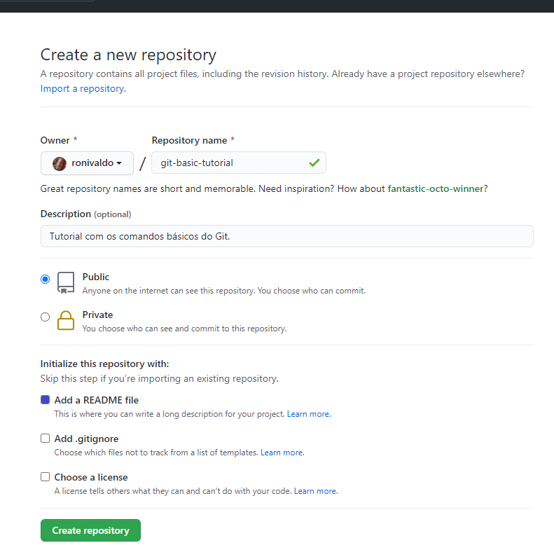

O seu repositório está criado e os arquivos estão no `Remote Repo` Github.

## 2 - Clonando para seu computador

Entre no diretório que deseja criar o repositório e execute o comando:

```bash
git clone https://github.com/ronivaldo/git-tutorial-basico.git
```

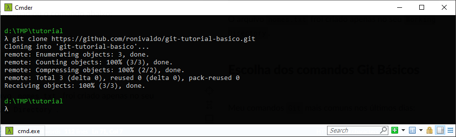

O seu repositório foi clonado para seu computador e os arquivos estão no `Remote Repo`  Github e também no `Working Directory` git-tutorial-basico.

Obs: mude o nome `git-tutorial-basico` para o nome do repositório que você criou.

## 3 - Adicionando arquivos

Acesse o `Working Directory` git-tutorial-basico.

```bash
cd git-tutorial-basico
```
Crie um arquivo `nomes.txt` e coloque seu nome lá dentro.

Use o Notepad ou o comando abaixo:

```bash
echo "Ronivaldo" > nomes.txt
```

O arquivo `nomes.txt` froi criado apenas no seu `Working Directory` e o `git` não tem controle sobre ele por enquanto.

Verifique o status do repositório com o comando:

```bash
git status
```
Observe que o arquivo `nomes.txt` está marcado como `untracked` - não rastreado pelo `git`.

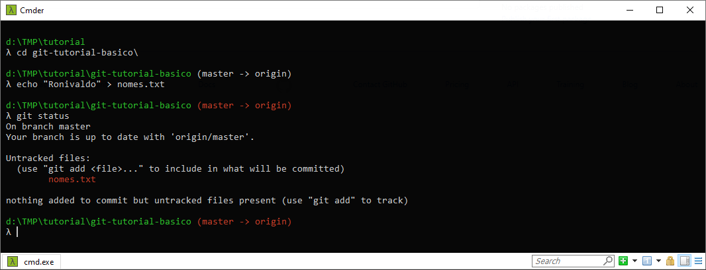


## 4 - Rastreando Arquivos

Para que o `git` monitore o arquivo, execute o comando:

```bash
git add nomes.txt
```

Verifique o status do repositório com o comando:

```bash
git status
```
Observe que agora o arquivo `nomes.txt` está rastreado pelo `git`.

O arquivo `nomes.txt` foi no seu `Working Directory` e depois do comando `git add` ele também foi adicionado na áre de rascunho `Staging area`. No entanto, ele ainda não está no `Local Repo` e nem no `Remote Repo`.

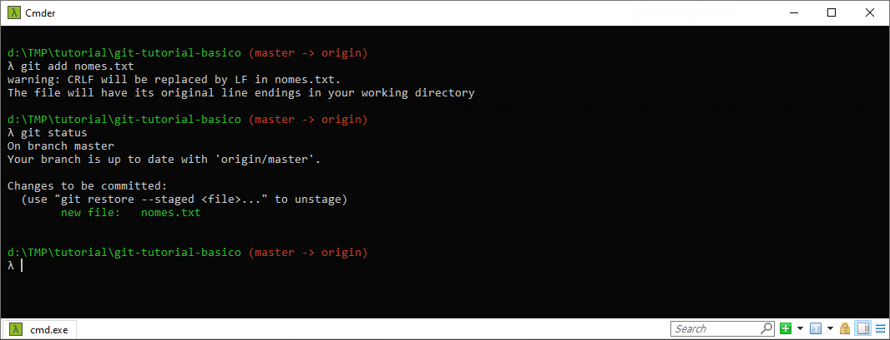


## 5 - Adicionando no Repositório Local

Para guardar o arquivo no  `Local Repo`, execute o comando:

```bash
git commit -m "adicionado o nome Ronivaldo"
```

Verifique o status do repositório com o comando:

```bash
git status
```
Observe que agora o `git` informa que o seu repositório `Local Repo` está com `1 commit`  a mais que o `Remote Repo`.

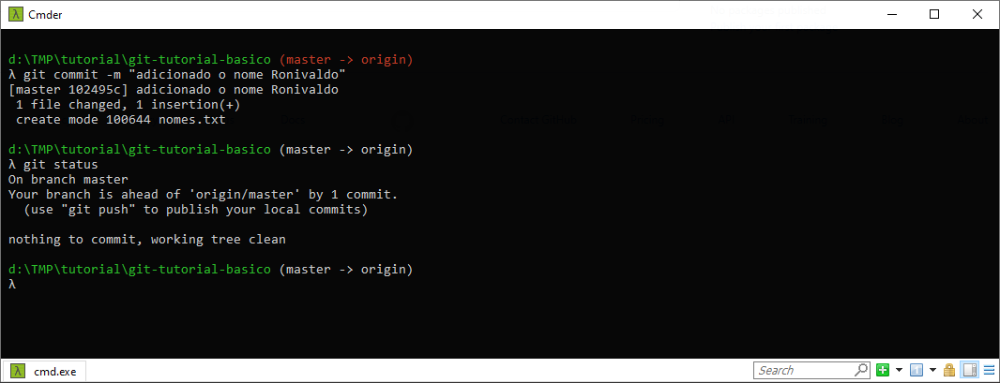

O arquivo `nomes.txt` está no seu `Working Directory` e depois do comando `git commit` ele saiu da área de rascunho `Staging area` e foi adicionado  no `Local Repo`. Porém ainda não está no `Remote Repo`.


## 6 - Adicionando no Repositório Remoto

Para guardar o arquivo no  `Remote Repo`, execute o comando:

```bash
git push origin
```

Verifique o status do repositório com o comando:

```bash
git status
```
Observe que agora o `git` informa que o seu repositório `Local Repo` está com atualizado com o  `Remote Repo`.

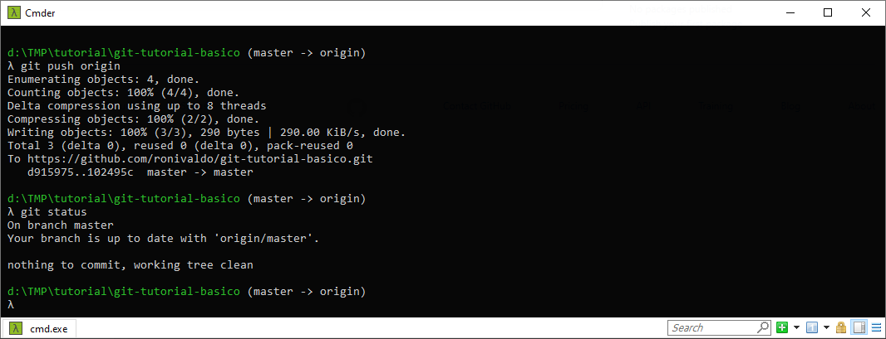

O arquivo `nomes.txt` está no seu `Working Directory` e `Local Repo`,  depois do comando `git push origin` ele foi adicionado também no  `Remote Repo`.

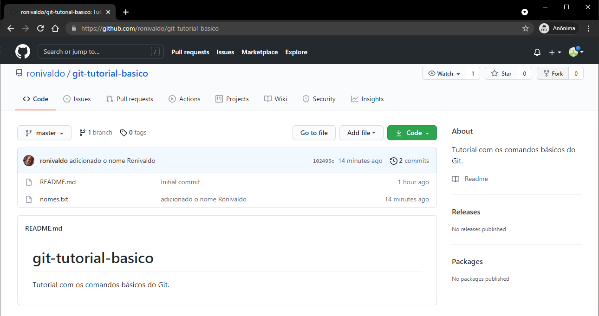

Pronto, agora você já domina os comandos básicos do `git`.


## 6 - Pull Request

Uma tarefa muito comum é a Pull Request - `PR`. 

Para criar um `PR`, basta realizar o `Fork` do respositório de um usuário para a sua conta no `Github`.

Acesse a url do repositório e clique no o botão `Fork`.
https://github.com/ronivaldo/git-tutorial-basico


Agora você tem uma cópia do projeto na sua conta e poderá copiar para o seu computador e realizar as modificações necessárias.

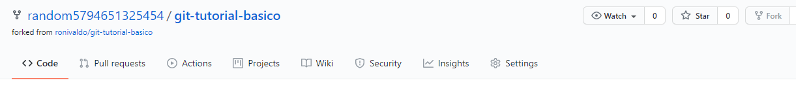

Entre no diretório que deseja clonar o repositório e execute o comando:

```bash
git clone https://github.com/random5794651325454/git-tutorial-basico.git
```
Obs: mude a  `url` para o corresponder ao seu repositório que você fez o `Fork`.

Depois de clonar o repositório, entre no diretório:

```bash
cd git-tutorial-basico
```

Verifique o status do repositório com o comando:

```bash
git status
```

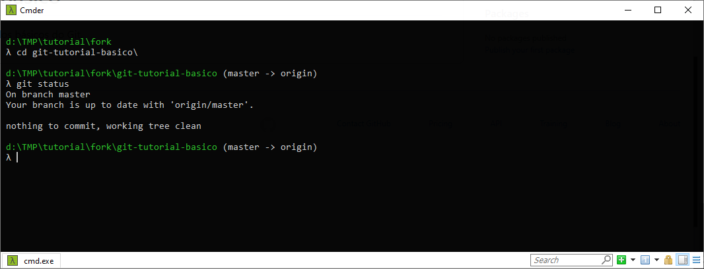

Liste os arquivos com `dir` - Windows ou `ls -la` - Linux:

```bash
dir
```

Exiba o conteúdo do arquivo `nomes.txt` com o comando  `type nomes.txt` - Windows ou `cat nomes.txt` - Linux:

```bash
type nomes.txt
```

Use o Notepad ou o comando abaixo para adicionar um nome nome na última linha do arquivo:

```bash
echo "Joao" >> nomes.txt
```

Obs: use o seu nome no lugar de João.

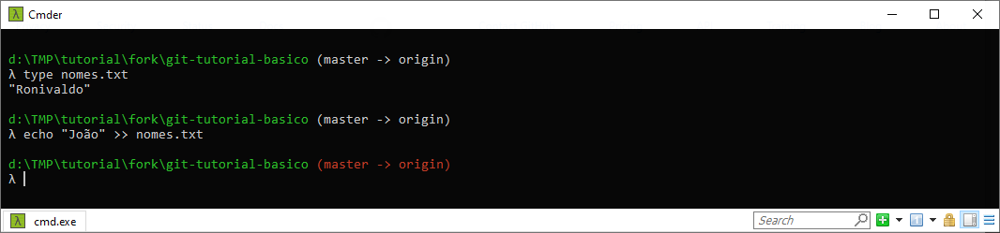

Verifique o status do repositório com o comando:

```bash
git status
```

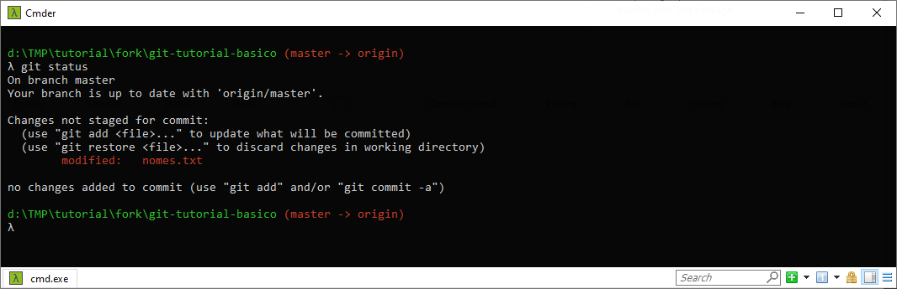

O arquivo `nomes.txt` froi criado apenas no seu `Working Directory` e o `git` não tem controle sobre ele por enquanto.

Adicione o arquivo para monitoramento do `git`:

```bash
git add nomes.txt
```

Guarde o arquivo no  `Local Repo`, com o comando:

```bash
git commit -m "adicionado o nome Joao"
```

Guarde o arquivo no  `Remote Repo`, execute o comando:

```bash
git push origin
```

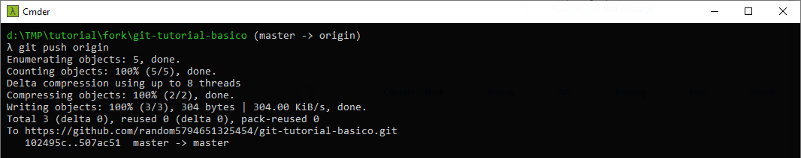

O arquivo `nomes.txt` está atualizando também no  seu `Remote Repo`.

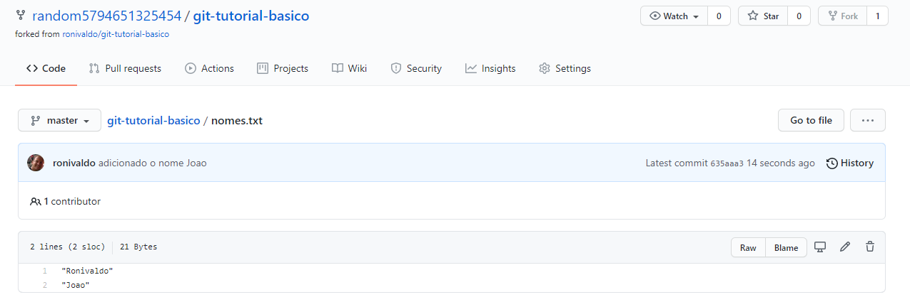

Na aba `Pull Requests`, clique no botão `New pull request`.

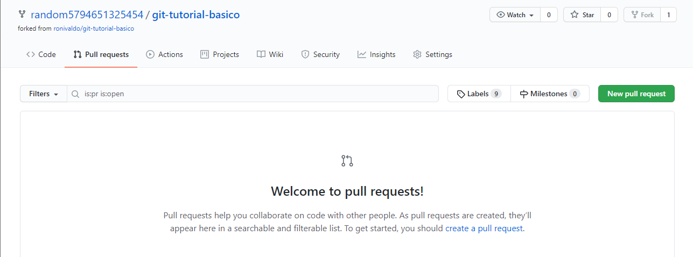

Coloque o `Título` e uma `Descrição` completa para que o autor entenda o que você está modificando no projeto e depois clique em `Create pull request`.

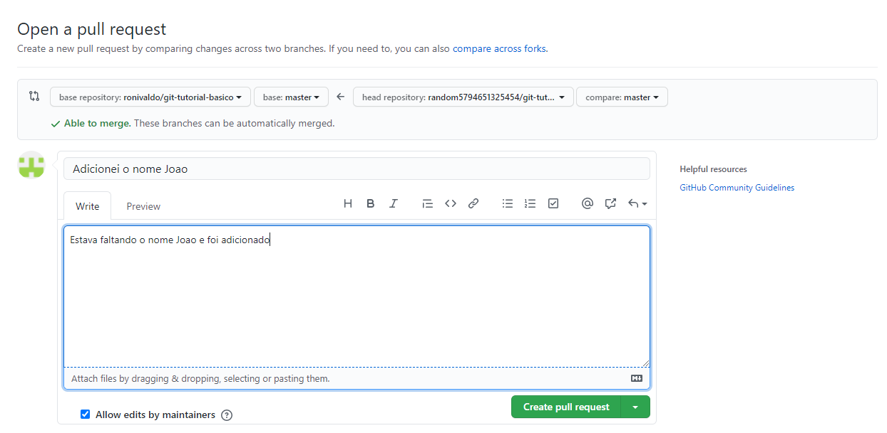

Pronto, seu `PR` foi criado com sucesso.

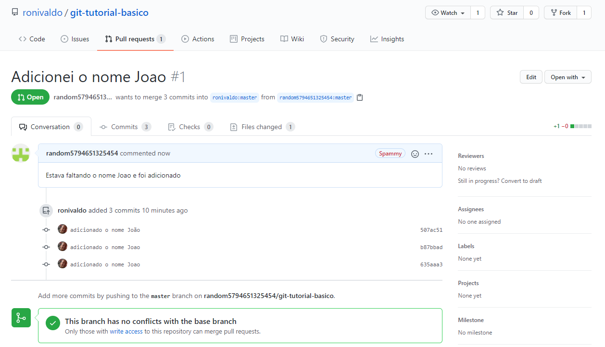

Assim que o autor do projeto aprovar o seu `PR`, o projeto receberá as suas contribuições.

Faça o seu `PR` para este `git` [https://github.com/ronivaldo/git-tutorial-basico](https://github.com/ronivaldo/git-tutorial-basico) e adicione o `seu nome` também para que todos vejam que você concluiu esse tutorial.

Parabéns para você que chegou até aqui!

Veja quem já contribuiu com esse repositório acessando o arquivo [nomes.txt](./nomes.txt).


## Contribua com este Repositório

Melhore este tutorial e faça um `PR`, todos agradecem!


## Escolha dos comandos Git Básicos

Meu comandos `git` mais comuns nos últimos dias:

```bash
cat D:\cmder_mini\config\.history | grep "git " | cut -d' ' -f1-2 | sort | uniq -c | sort
```

```
      1 git origin
      1 git tags
      2 git branch
      2 git checout
      2 git comit
      2 git log
      2 git pugh
      2 git version
      4 git remote
      5 git show
      5 git staus
      6 git config
      6 git tag
     15 git diff
     22 git pull
     34 git checkout
     50 git clone
     98 git status
    101 git flow
    107 git push
    195 git add
    277 git commit
```

Daí foram escolhidos os comandos mais básicos:
```
     50 git clone
     98 git status
    107 git push
    195 git add
    277 git commit
```
Depois que fizer estes tutorial, você pode aprender mais sobre o `Git Flow` aqui :  https://nvie.com/posts/a-successful-git-branching-model/

----

Gitcheat e imagens gentilmente cedidas por:
http://learnstemlabs.com/articles/gitcheatsheet/